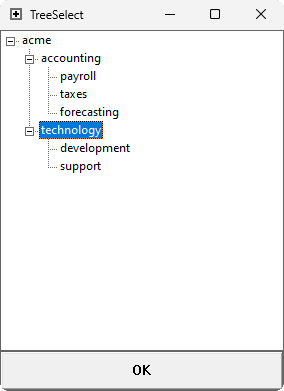

TreeSelect is a simple utility meant to be used as part of other tools or scripts. You pipe JSON to STDIN, it presents a selection dialogue to the user, then it prints the user's selection to STDOUT. If any arguments are specified on the command line, they will become the window title.

Example JSON:
```json
{
	"acme": {
		"accounting": {
			"payroll": {},
			"taxes": {},
			"forecasting": {}
		},
		"technology": {
			"development": {},
			"support": {}
		}
	}
}
```

Example Screenshot:



Example Output:
```txt
acme/technology
```
